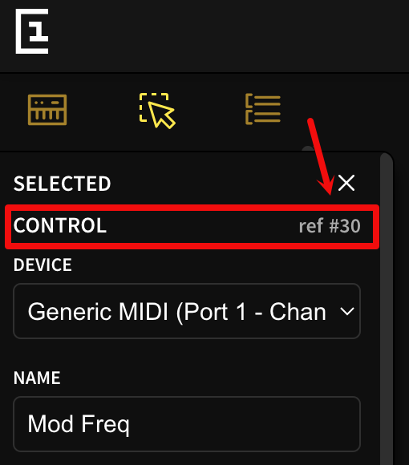

# Adding or changing presets, and other advanced configuration

The remote script can be adapted in interesting ways: the mixer preset can be customised to your taste, device presets can be customised or added as well, and some other advanced configurations is possible. These are discussed below.

## Changing the mixer preset

There is nothing specific about the design of the mixer apart from the MIDI channel, Electra One port and CC number assignments of individual controls. This means you can (more or less) freely redesign the mixer to your own needs, e.g one where tracks are laid out horizontally instead of vertically (such that all track controls are active at the same time). But please make sure that *all* controls retain both their original CC numbers *and* their original control id! And read the [extensive documentation on the mixer](https://github.com/xot/ElectraOne/blob/main/DOCUMENTATION.md#the-mixer-mixercontroller) too!

*Warning: do NOT remove any controls; this may break the script/mixer preset. The reason is that controls associated with (return) tracks that are not present in Ableton are hidden using their control id; the LUA scripting embedded in the Mixer preset responsible for that assumes these controls exist.*

As an example, an alternative mixer design [is included](https://app.electra.one/preset/m6YGx6rIQMQHTXB6VMFw) in the distribution that shows the transport controls on all pages, at the cost of removing one return track and removing the rumble/high-pass toggle from the channel eq page. See ```Mixer.alt.eproj```. To use it, copy ```config_mixer_alt.py``` to ```config.py```.

(Note: this alternative mixer design uses features only supported on the E1 mkII for the tempo and position controls.)

## Changing predefined device presets

You can modify existing predefined presets, or add new ones for other, non-standard, devices or plugins. Sources for the existing presets can be found in this repository of course, or in the [E1 web editor](https://app.electra.ome): simply select 'Ableton' as brand in the Preset Library browser.
 
The remote script uses three pieces of information to enable a preset to control a device in Live.

- The actual E1 preset, stored in `<devicename>.epr`, that can be edited using the E1 preset web editor.
- A mapping of the controls in this E1 preset to the parameters of the Ableton device, stored in `<devicename>.ccmap`. This maps the name of each parameter in Live to the CC control numbers assigned to the controls in the preset.
- (optional) LUA scripting code for the E1 preset, stored in `<devicename>.lua`, that can also be edited using the E1 preset web editor.
 
### Modifying existing device presets

For existing predefined presets, these files can be found in the ```./preloaded``` subfolder in the ```ElectraOne``` remote script folder.

To modify such an existing preset, proceed as follows.

1. To edit the preset, import  ```<devicename>.epr``` in the [E1 web editor](app.electra.one). Once you are happy with the result, export the preset  ```<devicename>.epr``` and save it back into the ```preloaded``` folder (overwriting the existing file).
3. If you modified the LUA script, cut and paste it into  ```<devicename>.lua``` in the ```preloaded``` folder (overwriting the existing file).
3. Restart Ableton.

If you now load the device again and select it, the preset you created should appear on the E1. (If the preset is preloaded - which is typically the case for predefined presets - set ```USE_PRELOAD_FEATURE=False``` to override their use; once you are happy with the design you can preload it too, see [below](#preloaded-presets).)

*When editing the preset in the webeditor, make sure not to change any of the device and CC assignments of the controls; these need to stay the same in  order to correspond to the definitions in the CC map. Sometimes the [control-id](https://docs.electra.one/developers/presetformat.html#id-4) is relevant and should not change. In that case, use cut and paste to move controls around without changing their control-id.*

Apart from that, anything goes. This means you can freely change controller names, specify value ranges and assign special formatter functions. Also, you can remove controls that you hardly ever use and that would otherwise clutter the interface.

### Adding new device presets

For devices that do not yet have a predefined preset, the remote script can dump the preset it created on the fly for this device. Configuration ```DUMP``` (see ```config.py```)  needs to be set to ```True``` for this. The dumped files (the ```<devicename>.epr``` and ```<devicename>.ccmap```) can be found in the ```./dumps``` subfolder.

Using such a device dump as a starting point for a new preset ensures that

- all device parameters have a control in the preset, with some sensible default settings, and
- a CC map with proper mapping definitions is constructed.

To create a preset for a new device, therefore proceed as follows.

1. Enable dumping of presets (set ```DUMP = True``` in ```config.py```).
2. Start Ableton, and make sure the remote script is active.
3. Load the device you want to create a preset for and select it; a blue hand should appear in it (and the preset that is constructed on the fly should appear on the E1).
4. This should create ```<devicename>.epr``` and ```<devicename>.ccmap``` in the ```dumps``` directory in the remote script folder.
5. Copy ```<devicename>.ccmap``` and ```<devicename>.epr``` to the ```preloaded``` folder. No LUA file is created.
6. Continue with the steps described above for editing existing presets.

The construction of presets on the fly is controlled by several constants defined in ```config.py```. See the [documentation of advanced configuration options](#advanced-configuration) below.

### Advanced features

For basic use, the CC map for a preset does not have to be modified. But to fine-tune value display, this may sometimes be necessary. For details, see the [technical documentation](https://github.com/xot/ElectraOne/blob/main/DOCUMENTATION.md#curated-presets). This also describes how to use LUA to format specific types of values.

For example, if you set the control identifier in the CC-map of a parameter to the actual identifier in the preset (instead of -1), the remote script sends the textual representation of the current value of the parameter as reported by Ableton Live to the E1. To make sure it is displayed, set the ```formatter``` function field in the E1 preset to ```defaultFormatter```.

### Naming 

In all of the above `<devicename>` is the device name used by Ableton for the device, e.g. `Echo`. 

For Max devices and external plugins (AU, VST) a slightly different naming scheme is used (as there is unfortunately no reliable way for the remote script to get the device name for a plugin or a Max device).

The remote script uses the following hack to still allow a fixed device name to be found. Enclose such a plugin or Max device *as the only device* in an instrument, midi, or audio rack and rename that enclosing rack to the device name of the device. In this specific case, the remote script uses the name of the enclosing rack as the name to use for the plugin or Max device when dumping its preset or when looking up a predefined or preloaded preset. So if a plugin is in a rack with name ```MiniV3``` then ```MiniV3``` is used as the device name to lookup any predefined preset. (If a plugin is not enclosed in a rack, then its own preset name is used as the device name.)

Note that in order to distinguish names for presets for racks themselves from the names used by an embedded preset, the remote script adds a hash (```#```) to the preset name of a rack. So in the example above, if you would select the rack with name ```MiniV3``` the remote script would look for a preset called ```MiniV3#```. (This compromise was chosen as it is less likely people will want to make custom presets for racks; after all, the order of parameters in a Rack can already be controlled in Live itself.) 

### Defining presets for specific versions of Live

To include presets for specific versions of Live, append the version number to the devicename. E.g. ```MidiRandom.12.epr``` would be used for all version of Live equal or above version 12. And, say ```Echo.11.3.10``` would be used for all version of Live equal or above version 11.3.10.

### Tips and tricks

For consistency, all predefined presets use the same colour and control for the same type of parameter. These are documented in [this preset in the web editor](https://app.electra.one/preset/uygbxDtRbf2G6Kd54xXX).

In Ableton, the visibility (or type) of certain parameters may depend on the value of other parameters in the device. This can be emulated in a preset for such a device with some LUA programming. The following examples come from the [Echo preset](https://app.electra.one/preset/CJMvgH9pfNCBqKIe3Amg).

The LFO modulation settings are good example for a simple scenario, where the setting of one parameter determines which of a set of other controls for other paramters (in this case two controls) needs to be shown in the same slot. Echo defines a `Mod Sync` parameter telling Echo whether to speed of the LFO should run in sync with the current tempo (controlled by the `Mod Rate` parameter) or should run at a particular frequency (controlled by the `Mod Freq` parameter). If `Mod Sync` is true, the `Mod Rate` parameter control should be shown. Otherwise the `Mod Freq` parameter control should be shown.

The preset editor allows one to provide a callback [function](https://docs.electra.one/developers/presetformat.html#function) for a control, that will be called whenever the value of that control changes (either by turning the pot on the E1, or because of an incoming MIDI message). The name of this callback function can be set in the left settings pane for the control on the webeditor. The name should refer to a function defined in the LUA section of the preset. This function should accept two parameters: `valueObject` (the control id of the object triggering the function) and `value`
(containing its new value).

In the case of Echo, the value of this function for the `Mod Sync` control is set to `modsync` (see the figure).


And the corresponding function is defined as
```
function modsync(valueObject, value)
    modfreq:setVisible(value == 0)
    modrate:setVisible(value ~= 0)
end
```

The LUA function `control:setVisible(v)` changes the visibility of `control` depending on the (boolean, true or false) value of `v`. In the example above `v` is an expression: `value == 0` (returning true if `value` equals 0) and `value ~= 0` (returning true if `value` does not equal 0).

`control` should refer to a internal LUA representation of the control shown by the E1. This representation can be obtained using the `controls.get(index)` function, provided one knows the control index of the control. This index is visible in the web editor when selecting the control. (See the figure for the control index of the `Mod Freq` control.)



In case of the Echo preset, the following LUA code obtains the necessary references:
```
modrate = controls.get(32)
modfreq = controls.get(30)
```
The only thing that remains to be done is to ensure that both controls are shown in the same slot. The web editor does not allow us to create presets that have more than one control in a slot, but the E1 firmware does allow for this. In the case of Echo the `Mod Freq` control is shown in the correct slot (slot 7 on page 2), but the `Mod Sync` control is shown on page 7 in the preset (this page is marked as invisible). To move this control to the correct slot, the following LUA code is executed:
```
modrate:setSlot(7,2)
```

For more complex scenarios where the visibility of a control depends on more than one parameter, a different approach should be used. For each such parameter controlling visibility, define a variable in LUA that follows the value of that parameter. For example, the Echo preset defines the state variable
```
islinked = false
```
to follow the state of the `Link` parameter in Echo (that controls whether the right channel settings should follow the left channel settings). 

Next define a callback function for that parameter that updates the value of this state variable, and assign its name to the parameter control in the web editor. Echo defines
```
function lrlink(valueObject, value)
    islinked = (value ~= 0)
    setvisibility()
end
```
and assigns its name to the `Link` callback function.

After updating `islinked` this function calls `setvisibility`. This is defined elsewhere as follows.
```
function setvisibility()
    ltime:setVisible(not islsync)
    l16th:setVisible(islsync and isl16th)
    ldiv:setVisible(islsync and not isl16th)
    rtime:setVisible(not islinked and not isrsync)
    r16th:setVisible(not islinked and (isrsync and isr16th))
    rdiv:setVisible(not islinked and (isrsync and not isr16th))
    rs:setVisible(not islinked)
    rm:setVisible((not islinked) and isrsync)
    lm:setVisible(islsync)    
end
```
It sets the visibility of a several controls (like the different left and/or right tempo controls) depending on the values of several state variables, including `islinked`.


## Preloaded presets

You can also manually upload a preset to the E1 (mkII only!) to create a preloaded version of it. For this, upload the new versions of both ```<devicename>.epr``` and the ```<devicename>.lua``` to the E1 at ```ctrlv2/presets/xot/ableton```. (The CC map does not have to be copied.)

Make sure to include the following line
```
require("xot/default")
```
at the start of the ```<devicename>.lua``` file. This includes some common LUA functions used by the remote script and the preset.

Note that you need to keep the original ccmap, preset and LUA files also in the `./preloaded` folder of the remote script. (Otherwise the remote script cannot properly control the preset.)


## Advanced configuration

The behaviour of the remote script can be changed by editing ```config.py```:

- ```E1_PRESET_FOLDER``` subfolder on the E1 where the preloaded presets are stored, relative to ```ctrlv2/presets``` (only possible for E1 mkII with firmware 3.4 and higher). The default is ```xot/ableton```.
- ```E1_LOGGING``` controls whether the E1 should send log messages, and if so how detailed. Default ```-1``` (which means no logging). Other possible levels: ```0``` (critical messages and errors only), ```1``` (warning messages), ```2``` (informative messages), or ```3``` (tracing messages).
- ```E1_LOGGING_PORT``` controls which port to use to send log messages to (0: Port 1, 1: Port 2, 2: CTRL). Default is 2, the CTRL port.
- ```DUMP``` controls whether the preset and CC map information of the  currently appointed device is dumped  (to ```./dumps```). The default is ```False```.
- ```RESET_SLOT``` (default ```(5,11)``` i.e the last, lower right slot in the sixth bank); when selected the remote script resets.
- ```EFFECT_REFRESH_PERIOD``` amount of time (in 100ms increments) between successive refreshes of controls on the E1 whose string values need to be provided by Abelton (default is 2).
- ```E1_PORT``` port number used by the remote script for input/output (0: Port 1, 1: Port 2, 2: CTRL), i.e. the one set in Ableton Live preferences. (Default is 0).
- ```E1_PORT_NAME``` (default is ```Electra Controller Electra Port 1```), the name of ```E1_PORT``` to use to upload presets using ```sendmidi```

The following constant deals with the slot where device presets are loaded.

- ```EFFECT_PRESET_SLOT``` E1 preset slot where the preset controlling the currently appointed device is stored. Specified by bank index (0..5) followed by preset index (0.11). The default is ```(5,1)```.

The following constants *only* influence the construction of presets 'on the fly' and do not affect predefined or preloaded presets:

- ```MAX_CC7_PARAMETERS``` and ```MAX_CC14_PARAMETERS``` limits the number of parameters assigned as CC7 or CC14 parameters. If ```-1``` (the default) all parameters are included (limited by the number of available MIDI channels and CC parameter slots): this is a good setting when dumping devices and/or when setting ```ORDER = ORDER_DEVICEDICT```.
- ```MIDI_EFFECT_CHANNEL``` is the first MIDI channel to use to assign device parameters controls to. The default value is 11.
- ```MAX_MIDI_EFFECT_CHANNELS``` limits the number of MIDI channels used in a preset constructed on the fly; -1 means all MIDI channels are used. If this means that there are more parameters then available CC numbers, those parameters are not assigned. The default is -1.

The following constants deal with the mixer preset.

- ```MIXER_PRESET_SLOT``` E1 preset slot where the master preset is stored. Specified by bank index (0..5) followed by preset index (0..11). The default is ```(5,0)```.
- ```MIDI_MASTER_CHANNEL```,  ```MIDI_TRACKS_CHANNEL``` and ```MIDI_SENDS_CHANNEL``` set the distinct MIDI channels to map the master, track, and sends controls to. See the [technical documentation](./DOCUMENTATION.md) for details.
- ```MAX_NO_OF_SENDS``` sets the maximum number of sends (and return tracks) present on the controller (currently 6).
- ```NO_OF_TRACKS``` sets the number of tracks present on the controller (currently 5).
- ```FORW_REW_JUMP_BY_AMOUNT``` the number of beats (i.e. quarter notes) to jump ahead or back when rewinding or moving forward. The default is 1. 
- ```TEMPO_JUMP_BY_AMOUNT``` the amount to increase or decrease the tempo with. The default is 0.5. 

The following constants deal with the equaliser devices managed through the mixer preset

- ```TRACK_EQ_DEVICE_NAME``` and ```MASTER_EQ_DEVICE_NAME```: (class)name of the equaliser device (on the normal tracks and the master track respectively) to be managed by the mixer preset.
- ```TRACK_EQ_CC_MAP``` and ```MASTER_EQ_CC_MAP```: CC mapping information describing which equaliser controls are mapped, and through which CC.


