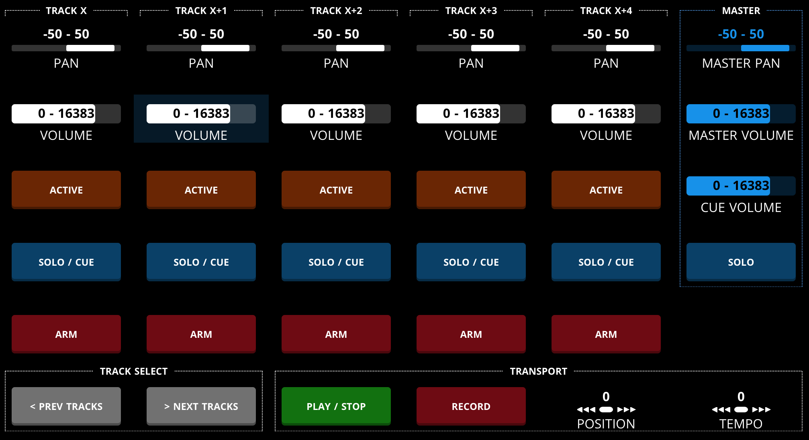
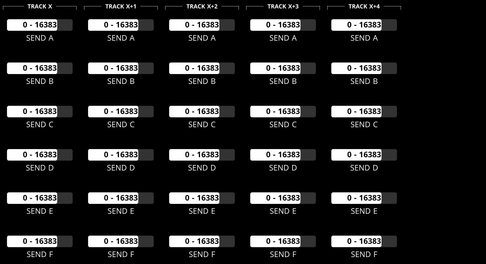
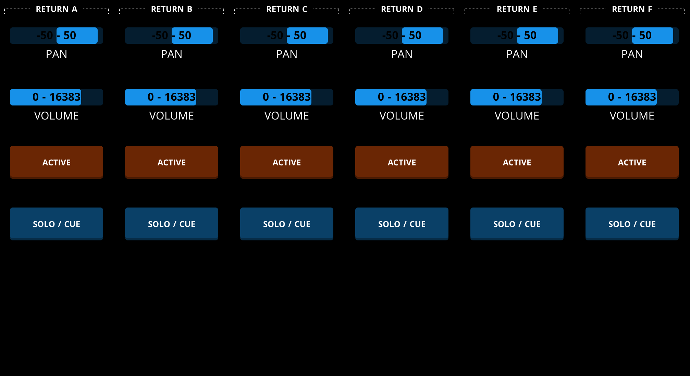
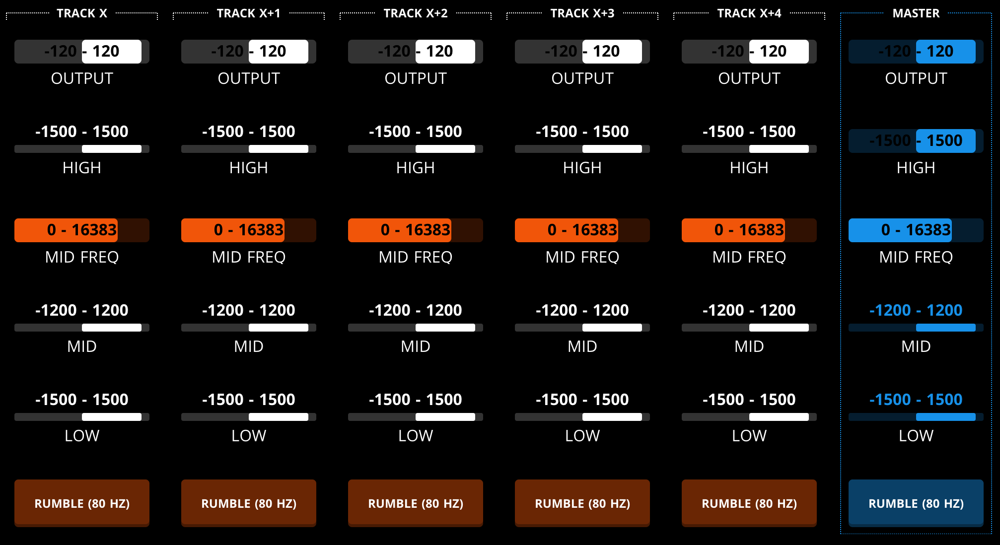
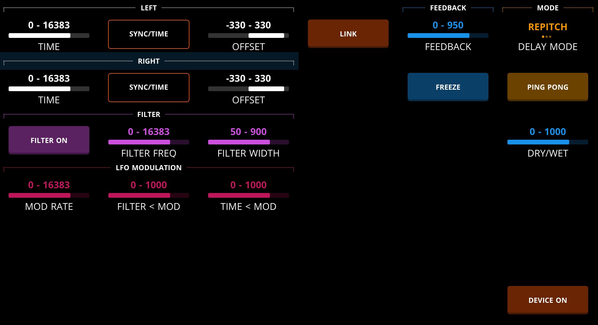
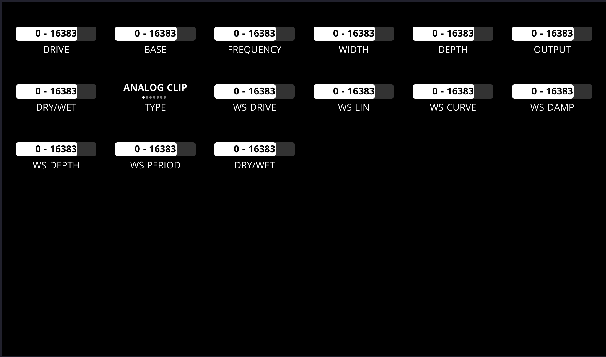
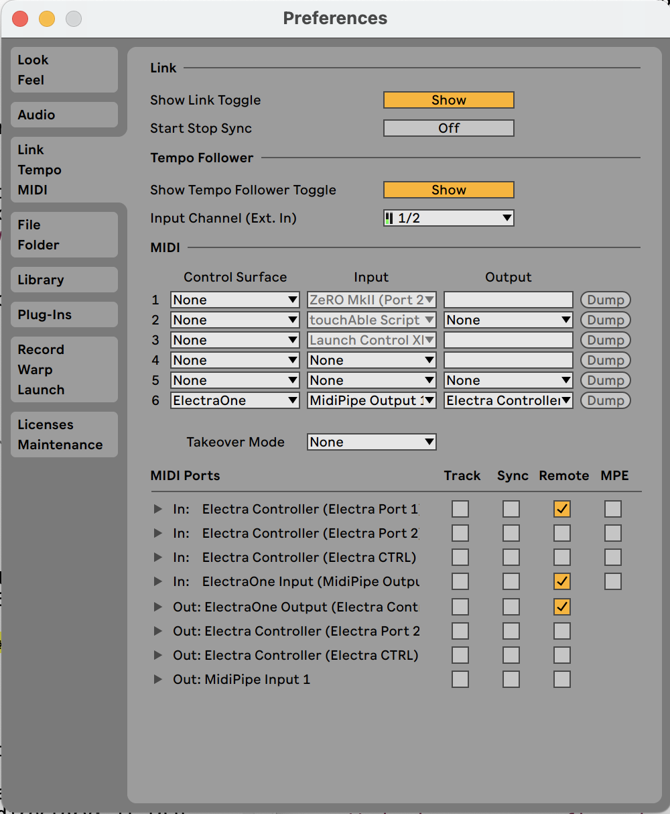

# ElectraOne

Ableton Live MIDI Remote Script for the Electra One.

## What it does

This Ableton Live MIDI Remote script allows you to control [the session mixer](#the-mixer) and the parameters of the [currently selected device](#controlling-the-currently-appointed-device) in Ableton Live using the [Electra One](https://electra.one), E1 for short. 

It can also be used to dump E1 presets for Ableton Live devices with sensible default control assignments, which can be used to craft your own preset designs to control these devices.

The remote script comes with a default Ableton Live template (```Live template.als```) that has several Channel EQs configured on the tracks, together with an [E1 mixer preset](#the-mixer) (```Mixer.eproj```) to control it.

The remote script also comes with specially crafted predefined presets for most of the Ableton Live effects and instruments.


(*Note: this is a beta release, but it should be relatively stable and usable by now. The current version works best with E1 firmware version 3.5*)

## The mixer

The mixer preset controls five consecutive session tracks parameters: pan, volume, mute, solo and arm. The 'prev tracks' and 'next tracks' buttons on the main page switch control to the previous five or next five tracks (never shifting left of the first or right of the last visible track). Inserted or removed tracks are automatically handled. The 'Main' mixer page also contains controls for the master pan, volume, cue volume, and solo switch. And it contains the following transport controls: play/stop, record, rewind, and forward.




For each track, the level of at most six sends can be controlled (see the 'Sends' page). Note that the sends on the return tracks (that are disabled by default in Live) are not included and cannot be controlled by the mixer.



The return track corresponding to each send can be managed using the controls on the 'Returns' page: pan, volume, and mute.



Finally a separate 'Channel EQs' page contains controls the parameters of an equaliser device (by defauklt the Channel EQ device), when present on an audio/midi track or the master track. (When more than one ChannelEq device is present, the last, rightmost ChannelEq device will be controlled.)



All controls on all pages are synced with the values of the parameters in Live they control as soon as a selection changes, or when parameters in Live are changed through the UI or using a different controller.

When fewer than 5 tracks and fewer than 6 return tracks are present in the Live set, the controls on track strips on the E1 for tracks that are not present in Live are hidden.


The mixer preset is included in the distribution (```Mixer.eproj```), and is also [available in the online E1 preset library](https://app.electra.one/preset/CK3qbv7Vt43PN4LkBTy7). It should be uploaded to bank 6, slot 1 (see [the E1 documentation](https://docs.electra.one/account.html#preset-slots); search for ```Ableton Mixer``` in the the preset list on the right side of the page ). 

*Please make sure to upload the latest version each time you upgrade the script.* 

## Controlling the currently appointed device

The remote script also allows the E1 to control the currently selected device on the currently selected track in Live. This specific selected device is called the *appointed* device (and is indicated by Live using the 'Blue Hand').

For this to work, the E1 needs to use a preset whose controls correspond to the parameters of the appointed device. The remote script then automatically maps these controls to the parameters.

The remote script comes with predefined presets for many of Ableton Live's effects and instruments. (The layout and control information for these predefined devices is stored in ```Devices.py```.) The figure shows the preset for ```Delay```.

Starting with firmware 3.4 on a modern E1 (the mkII, i.e hardware revision 3.0 or larger), these predefined devices can also be preloaded to the E1 for fast recall. See for [instructions below](https://github.com/xot/ElectraOne#installation).

And if no preloaded or predefined presets for a device are found, the remote script can [construct one on the fly](https://github.com/xot/ElectraOne#creating-presets-on-the-fly).

So when you select a new device in Live, the following happens.

- First, the remote script tries to activate a preset for the device that is already preloaded on the E1. (For older, mkI, E1 this step is skipped.) 
- If that fails, it looks for a predefined preset for the device in ```Devices.py``` and uploads and activates it.
- And if no such preset is found, the remote script constructs one on the fly and uploads that preset to the E1 instead, and activates it.



The preset is (up)loaded to the E1 to the second preset slot in bank 6 by default (*overwriting any preset currently present in that slot*). All controls in the preset are mapped to the corresponding parameter in the device. 

You can edit or add your own favourite preset layouts [as described in this separate document](https://github.com/xot/ElectraOne/blob/main/README-ADDING-PRESETS.md#adding-preloaded-device-presets).


### Switching between device and mixer view

You can use the normal way of switching between presets on the E1 via the MENU button. 

There is a faster way however (when ```CONTROL_MODE=CONTROL_EITHER```).
Pressing the PRESET REQUEST button on the E1 (right column, top button) will
alternate between the mixer and the appointed device preset.

### Creating presets on the fly

If no preloaded or predefined preset exists, the remote script creates a preset on the fly. (The image shows the preset created on the fly for the Saturator effect, in 'sorted' order, see below.)



When constructing presets:

- On/off parameters are shown as toggles on the E1.
- Other 'quantised' parameters are shown as lists on the E1, using the possible values reported by Ableton. (In E1 terms, these are turned into 'overlays' added to the preset.)
- Non-quantised parameters are shown as faders on the E1. As many faders as possible are assigned to 14bit CCs. 
- Integer valued, non-quantised, parameters are shown as integer-valued faders on the E1. 
- Float valued parameters are shown as floar-valued faders on the E1. 
- For certain types of parameters (e.g. percentage, phase shift), the remote script tries to guess the type and adjust the display accordingly.

Note that large devices with many parameters may create a preset with several pages. The generation of presets on the fly can be customised, see the [configuration section](https://github.com/xot/ElectraOne#configuring).

### Racks

When selecting a rack (audio, instrument, drum or MIDI rack), the E1 automatically maps the macro's for the rack to controls on the E1. 

*Note: when using a drum rack on a visible track, by default it shows the last played drum instrument in the chain. Whenever an incoming note plays a drum instrument, this drum instrument becomes selected **and therefore gets (up)loaded to the E1**. This is of course undesirable as the E1 would get swamped with preset (up)loads. To avoid this, hide the devices on a drum track!*


### VST or AU plugins

VST or AU plugin parameters can also be managed, but this needs to be done in a slightly roundabout way in order to ensure the mappings are properly saved within Ableton.

Depending on the plugin, *first* create an audio or instrument rack. Then add the plugin to the rack. To manage the parameters within the plugin, click on the expand (triangle down) button in the title bar of the plugin to expose the 'Configure' button. Click on it and follow the instructions to add plugin parameters to the configuration panel. To save this configuration, *save the enclosing rack configuration*: saving the plugin state itself *does not save the configuration of parameters*! You don't need to bother about the macros, although it might be useful to assign them such that the most important parameters of the plugin are mapped on a single preset page.

#### Configuring Ableton to map AU and VST plugin parameters

To more easily control the parameters of AU and VST plugins in Ableton, you need to tell Ableton to automatically configure and reveal the plugin parameters. This is done by adding the following line to Ableton Live's ```Options.txt``` file (see this [Ableton help document](https://help.ableton.com/hc/en-us/articles/6003224107292-Options-txt-file) on where to find it and how to edit it).

```-_PluginAutoPopulateThreshold=128```

Note the hyphen followed by the underscore! Also this is not guaranteed to work for all plugins; I've seen it work for AU plugins but not for VSTs on MacOS.

## Installation

Make sure that the version of Ableton Live and the firmware of the E1 are supported (see below).


1. Create a new folder ```ElectraOne``` into your local Ableton MIDI Live Scripts folder: that is, create ```~/Documents/Ableton/User Library/Remote Scripts/ElectraOne``` on MacOS and ```~\Documents\Ableton\User Library\Remote Scripts\ElectraOne``` on Windows (that folder may not exist initially, in that case create it manually). Note that ```~``` stands for your home folder (```/Users/<username>/``` on the Mac and ```C:\Users\<username>``` on recent Windows versions).

2. Copy all files and subfolders and their contents that you find in the [ElectraOne remote script repository](https://github.com/xot/ElectraOne) to the ```ElectraOne``` folder you just created. The easiest is to download [the whole repository as a compressed zip file](https://github.com/xot/ElectraOne/archive/refs/heads/main.zip) and unpack on your computer (make sure to remove the ```ElectraOne-main``` root folder).

3. Connect the E1 to your computer with a USB cable ([see E1 documentation](https://docs.electra.one/#_2-connect-your-new-electra-one-controller-to-a-computer)).

4. *MacOS*: Add E1 as a Control Surface in Live > Preferences > MIDI. Set the both the input port and the output port to ```Electra Controller (Electra Port 1)```. For both, tick the *Remote* boxes in the MIDI Ports table below, untick the *Track* boxes. 



4. *Windows*: Add E1 as a Control Surface in Options > Preferences > MIDI. Set the both the input port and the output port to ```Electra Controller```. For both, tick the *Remote* boxes in the MIDI Ports table below, untick the *Track* boxes.

5. Upload the ```Mixer.eproj``` preset (included in the distribution) to the E1 to bank 6, slot 1.  See [above](https://github.com/xot/ElectraOne/blob/main/README.md#the-mixer).

6. If you run firmware version 3.4 or higher (*which is highly recommended because of the speed increase*) *and* own a E1 mkII, unpack the archive ```upload-to-E1.zip``` in the folder ```ctrlv2``` on the E1. (To do so, on an E1 mkII you need to [enable USB Disk mode](https://docs.electra.one/downloads/updatemkII.html#_4-enable-the-usb-disk-option)]. This should create a file ```ctrlv2/lua/xot/default.lua``` and a  folder ```ctrlv2/presets/xot/ableton``` containing all preloaded presets and their associated LUA scripts.

7. Start Ableton.

If all goes well, a patch for the appointed device (indicated by the 'Blue Hand') will automatically be created and/or (up)loaded and then mapped to the E1.

Enjoy!

### Using a second E1 to control the mixer

If you happen to own *two* E1s, then you can use the second one to control the mixer exclusively, while the first controls the currently selected device. 

Proceed as follows.

1. Connect both E1s to your computer, and make sure that both devices have separate names, e.g. `Electra Controller A`  and `Electra Controller B` (on the Mac, use ```Audio MIDI Setup``` for this).
2. Create a separate folder `ElectraOneMixer` in your local Ableton MIDI Live Scripts folder (see [installation instructions](#Installation) above), and copy all `.py` files in the `ElectraOne` folder to this new folder.
3. In Ableton, set up the remote script twice. Once using `ElectraOne` with input port and the output port ```Electra Controller A```, and using `ElectraOneMixer` with input port and the output port ```Electra Controller  B``` (if you used the names suggested in step 1). For all ports, tick the *Remote* boxes in the MIDI Ports table below, and untick the *Track* boxes.
3. For `ElectraOne` set `CONTROL_MODE = CONTROL_EFFECT_ONLY` in `config.py`. If you use SendMIDI (see above), make sure that your correctly set `E1_PORT_NAME` e.g. `E1_PORT_NAME = 'Electra Controller A Electra Port 1'`.
4. For `ElectraOneMixer` set `CONTROL_MODE = CONTROL_MIXER_ONLY` and `SENDMIDI_CMD = None` in `config.py`.
5. Restart Ableton.


### Log files

See 

- ```~/Library/Preferences/Ableton/Live <version>/Log.txt``` (on MacOS), or
- ```~\AppData\Roaming\Ableton\Live <version>\Preferences\Log.txt``` (on Windows)

for any error messages (again note that ```~``` stands for your home folder).

The log files in

- ```~/Library/Application\ Support/Ableton/Live\ Reports/Usage``` (MacOS), or
- ```~\AppData\Roaming\Ableton\Live Reports\Usage\``` (Windows)

are also useful.

### Installing SendMidi

Although not strictly necessary, the remote script becomes much more responsive (and usable) under MacOS if you install [SendMidi](https://github.com/gbevin/SendMIDI). (*It seems that sending larger MIDI messages natively through Live under Windows is faster than MacOS; SendMidi isn't necessary in that case, and is harder to install under Windows because it requires shared access to the MIDI port with which to communicate with the E1, which the default Windows MIDI driver does not support.*)

Here are the instructions for installing sendmidi 1.2.0 under MacOS.

Download the right binary [here](https://github.com/gbevin/SendMIDI/releases). Install the package by double clicking on it and following the steps in the installation program. Use the default settings (ie do not change the install location). This will create the sendmidi executable in ```/usr/local/bin/```. 

Set the following constants in the ```config.py``` (this is one of the files you just copied into the new ```ElectraOne``` folder that you created in your local Ableton MIDI Live Scripts folder):

- ```SENDMIDI_CMD = /usr/local/bin/sendmidi```
- ```E1_CTRL_PORT = 'Electra Controller Electra Port 1'``` (or whatever the exact name of MIDI Port 1 of the ElectraOne happens to be on your system; the value shown here is the default).

### Dependencies

This project depends on:

- Ableton Live 12 (tested with 12.0) or Ableton Live 11, tested with version 11.1.1 upto 11.3.12; code relies on Abelton Live supporting Python 3.6 or later.
- E1 firmware version 3.5 or later. See [these instructions for uploading firmware](https://docs.electra.one/troubleshooting/hardrestart.html#recovering-from-a-system-freeze) that you can [download here](https://docs.electra.one/downloads/firmware.html).
- Optional: [SendMidi](https://github.com/gbevin/SendMIDI), for faster preset uploading. 

### Current limitations

- Externally stored, user-defined, presets are not implemented yet. (You *can* add them to ```Devices.py```.)
- Uploading large patches is *slow*, unless you enable fast loading. (Best to stick to preloaded patches or setting ```ORDER = ORDER_DEVICEDICT```, which is the default.)

### Warning

**This is *beta* software.**

It was built using the [excellent resources](https://structure-void.com/ableton-live-midi-remote-scripts/) provided by Julien Bayle (StructureVoid), and Hanz Petrov's [introduction to remote scripts](http://remotescripts.blogspot.com/2010/03/introduction-to-framework-classes.html). Also the incredibly well maintained [documentation](https://docs.electra.one) for the E1 itself was super useful.

However, official documentation from Ableton to program MIDI remote scripts is unfortunately missing. This means the code seems to work, but I don't really know *why* it works. Clearly, this is dangerous. 

**Use at your own risk!**

## Configuring

The behaviour of the remote script can be changed by editing ```config.py```. Below the most basic configuration options are documented. More advanced configuration options are discussed [here](xx)

- ```LIBDIR``` determines where external files are read and written. This is first tried as a folder relative to the user's home folder; if that doesn't exist, it is interpreted as an absolute path. If that also doesn't exist, then the user home folder is used instead. If `None` (the default), the remote script directory is used.
- ```DEBUG``` the amount of debugging information that is written to the log file. Larger values mean more logging. Set to ```0``` to create no log entries and to speed up the script.
- ```DETECT_E1``` controls whether to detect the E1 at startup, or not. Default is ```True```.
- ```CONTROL_MODE``` whether the remote script controls both mixer and effect (```CONTROL_EITHER```), the mixer (```CONTROL_MIXER_ONLY```) or the effect only (```CONTROL_EFFECT_ONLY```).
- ```USE_ABLETON_VALUES```. Whether to use the exact value strings Ableton generates for faders whose value cannot be easily computed by the E1 itself (like non-linear frequency and volume sliders). Default is ```True```.
- ```SENDMIDI_CMD``` full path to the ```sendmidi```command. If ```None```(the default), fast uploading of presets is not supported.
- ```USE_PRELOAD_FEATURE```. Whether to use the preloaded presets feature (if supported). If false, the predefined presets in ```Devices.py``` are always used, overriding any (older) preloaded presets on the E1. Default is ```True```.
- ```POSITION_FINE```. Whether to update the position with every sub_division  change, or only every beat. Default is `True`.

If the sendmidi command cannot be found or fails, the remote script falls back to normal (slow) sending of presets through Live itself.

The following constants configure when a device is *appointed* (becomes the device to manage by the remote controller(s)) and how to respond to that.

- ```APPOINT_ON_TRACK_CHANGE``` Whether to appoint the currently selected device on a selected track (only guaranteed to work if this is the only remote script handling device appointment), or only do this when device is explicitly selected. Default is ```True```.
- ```SWITCH_TO_EFFECT_IMMEDIATELY```  Whether to switch immediately from the mixer preset to the effect preset whenever a new device is appointed in Ableton, or only switch when explicitly requested by the user by pressing the upper right preset request button on the E1. Default is ```True```.

The following constants *only* influence the construction of presets 'on the fly' and do not affect predefined or preloaded presets:

- ```PRESET_COLOR``` Default color to use for controls in a generated preset, as a hex-string (default is white, i.e.  ```FFFFFF```).
- ```ORDER``` specifies whether presets that are constructed on the fly arrange parameters in the preset in alphabetical order (```ORDER_SORTED```),  simply in the order given by Ableton (```ORDER_ORIGINAL```) or in the order defined in the Ableton Live remote script framework (```ORDER_DEVICEDICT```, the default). This is the same order as used by most other remote controllers, as this limits the shown controllers to only the most significant devices. Indeed, when selecting the latter option, any parameters not in the 'DEVICE_DICT' are not included in the JSON preset. (They *are* included in the CC map for reference, with a mapping of ```None```, but *not* in the dumped preset; you may therefore want to use ```ORDER_SORTED``` when dumping presets.)
- ```PARAMETERS_TO_IGNORE``` a dictionary, keyed by device name, containing for each device a list of names of parameters to ignore when constructing presets on the fly. The list with key "ALL" contains the names of parameters to ignore for all presets constructed on the fly. Can e.g. be used to exclude the "Device On" button normally included (setting ```{"ALL": ["Device On"]}```). Default ```{}```.
- ```PERSONAL_DEVICE_DICT``` Personal DEVICE_DICT: for named devices, contains a tuple of tuples containing the names of the parameters to include if ```ORDER=DEVICE_DICT``` e.g. ```PERSONAL_DEVICE_DICT = { 'Emit': ( ('Attack', 'Decay' ), ) }```  Do not forget a trailing comma (,) if you only add one tuple! Takes precedence over any entry for the same device in the global ```DEVICE_DICT```. Default ```{}```.

### Setting up logging

To log all events (also those that happen on the E1 itself), set ```DEBUG=5``` and ```E1_LOGGING=True``` in ```config.py``` (setting ```E1_LOGGING=False``` will still give a lot of debugging information without any logging from the E1). On the MAC, this should create log messages in ```~/Library/Preferences/Ableton/Live <version>/Log.txt``` (where ```~``` is your home folder). 

To actually catch the log messages from the E1 in the same log file set ```E1_LOGGING_PORT=0```. This directs the log messages from the E1 to Port 1 connected to Live. 

Alternatively, leave the default ```E1_LOGGING_PORT=2``` as is which direct log messages from the E1 to its CTRL port, and catch the log messages from the E1 independently either using the (old) E1 Console app or using the debugger in the [web app](https://app.electra.one), see [the E1 documentation](https://docs.electra.one/editor.html#lua-debugger)
for more information.

If you want to help to debug the remote script, you can extract the tail of the messages in this log file that were logged right before the bug, and submit a bug report.


## Recovering from errors

### Resetting the E1 

Should the E1 get bogged with presets or freeze, use this procedure for a 'factory reset'.

1. Disconnect Electra from the USB power.
2. Press and hold the top left button.
3. While keeping the button pressed, connect the USB power.
4. Keep the button pressed until the splash screen animation is completed

This procedure will start the E1 without loading any presets. Manually remove any problematic ones.


To completely erase the E1 and format the internal SD do the following

1. Disconnect Electra from the USB power.
2. Press and hold the left middle button.
3. While keeping the button pressed, connect the USB power.
4. Keep the button pressed for some time.

After this you need to update the firmware. See the [section on dependencies](##dependencies) on how to do that.

### Resetting the remote script

Occasionally, the remote script or the E1 may get in a bad state.

You can unplug and then replug the E1 to restart it and continue to use it with the remote script to see if that solves the problem. (See below for [how to completely reset](#recovering-from-errors) and remove all existing presets from it.)

If the remote script appears to have stopped working (typically noticeable if selecting a new device does not upload or change anything on the E1) you can reset the remote script by selecting the 'reset slot' on the E1 (by default this is the last, lower right slot in the sixth bank).

## Bug reports

If you encounter something you believe is a bug, please report it to me by email: [info@xot.nl](mailto:info@xot.nl). You can also create a [Github Issue](https://github.com/xot/ElectraOne/issues).

In the bug report please include:

- a concise description of the bug as subject,
- the firmware version your E1 runs,
- the version of Ableton Live you are running,
- the operating system (and version) Live runs on, and 
- a longer description of the bug, including what conditions seem to cause it and how exactly the bug manifests itself. Includes the (relevant contents) of the log-file (see [above](#log-files)). If necessary, increase ```DEBUG```, restart Live, and trigger the bug again. See above for how to create a useful log.

Before submitting a bug report, please have a look at the [current issues](https://github.com/xot/ElectraOne/issues) to see whether your bug has already been reported on earlier. You can also monitor this page to keep track of how your bug is being resolved.
