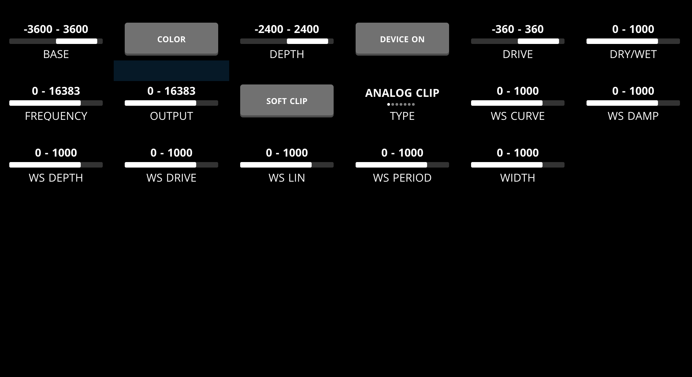

# ElectraOne

Ableton Live MIDI Remote Script for the Electra One.

## What it does

This Ableton Live MIDI Remote script allows you to [control the session mixer]((#the-mixer)) and the parameters of the [currently selected device](#controlling-the-currently-appointed-device) in Ableton Live using the [Electra One](https://electra.one), E1 for short. 

It can also be used to dump E1 presets for Ableton Live devices with sensible default control assignments, which can be used to craft ones own preset designs to control these devices.

The remote script comes with a default Ableton Live template (```Live template.als```) that has several Channel EQs configured on the tracks, together with an [E1 mixer preset](#the-mixer) (```Mixer.eproj```) to control it.

(*Note: this is a beta release, but it should be relatively stable and usable by now.*)

## The mixer

The mixer preset is included in the distribution (```Mixer.eproj```), and should be uploaded to a bank 6, first slot. *Please make sure to upload the latest version each time you upgrade the script.*

It controls five consecutive session tracks parameters: pan, volume, mute, solo and arm. The 'prev tracks' and 'next tracks' buttons on the main page switch control to the previous five or next five tracks (never shifting left of the first or right of the last visible track). Inserted or removed tracks are automatically handled. The 'Main' mixer page also contains controls for the master pan, volume, cue volume, and solo switch. And it contains the following transport controls: play/stop, record, rewind, and forward.


For each track, the level of at most six sends can be controlled (see the 'Sends' page). Note that the sends on the return tracks (that are disabled by default in Live) are not included and cannot be controlled by the mixer.


The return track corresponding to each send can be managed using the controls on the 'Returns' page: pan, volume, and mute.


Finally a separate 'Channel EQs' page contains controls to control the parameters of a Channel EQ device, when present on an audio/midi track or the master track. (When more than one ChannelEq device is present, the last, rightmost ChannelEq device will be controlled.)


All controls on all pages are synced with the values of the parameters in Live they control as soon as a selection changes, or when parameters in Live are changed through the UI or using a different controller.

When fewer than 5 tracks and fewer than 6 return tracks are present in the Live set, the controls on track strips on the E1 for tracks that are not present in Live are hidden.

### Alternative mixer designs

There is nothing specific about the design of the mixer apart from the MIDI channel, ELectra One port and CC number assignments of individual controls. This means you can freely redesign the mixer to your own needs, e.g one where tracks are laid out horizontally instead of vertically (such that all track controls are active at the same time).

*Warning: do NOT remove any controls; this may break the script/mixer preset. The reason is that controls associated with (return) tracks that are not present in Ableton are hidden using their control id; the LUA scripting embedded in the Mixer preset responsible for that assumes these controls exist.*

## Controlling the currently appointed device

In Ableton Live, each track typically has a selected device, and usually the selected device on the currently selected track is controlled by a remote control surface. This specific selected device is called the *appointed* device (and is indicated by Live using the 'Blue Hand').

The remote script looks for a preloaded preset for the appointed device in ```Devices.py``` and uses that if it exists. You can add your own favourite preset layout here. The easiest way to create such a preset (to ensure that it properly interfaces with this E1 remote script) is to modify dumps made by this script. See [below](#device-preset-dumps).


If no preloaded preset exists, it creates a preset on the fly. The preset is uploaded to the E1 to the second preset slot in bank 6 by default (*overwriting any preset currently present in that slot*). All controls in the preset are mapped to the corresponding parameter in the device. (The image shows the preset created on the fly for the Saturator effect, in 'devicedict' order, see below.)




When constructing presets:
- On/off parameters are shown as toggles on the E1.
- Other 'quantised' parameters are shown as lists on the E1, using the possible values reported by Ableton. (In E1 terms, these are turned into 'overlays' added to the preset.)
- Non-quantised parameters are shown as faders on the E1. As many faders as possible are assigned to 14bit CCs. (These CCs actually occupy *two* slots in the CC map, see below.) 
- Integer valued, non-quantised, parameters are shown as integer-valued faders on the E1. Other faders simply show a value within the minimum - maximum CC value range (although for faders with a large range this is currently not the case.).

Note that large devices with many parameters may create a preset with several pages.

### Racks

When selecting a rack (audio, instrument, drum or MIDI rack), the E1 automatically maps the macro's for the rack to controls on the E1

### VST or AU plugins

VST or AU plugin parameters can also be managed, but this needs to be done in a slightly roundabout way in order to ensure the mappings are properly saved within Ableton.

Depending on the plugin, *first* create an audio or instrument rack. Then add the plugin to the rack. To manage the parameters within the plugin, click on the expand (triangle down) button in the title bar of the plugin to expose the 'Configure' button. Click on it and follow the instructions to add plugin parameters to the configuration panel. To save this configuration, *save the enclosing rack configuration*: saving the plugin state itself *does not save the configuration of parameters*! You don't need to bother about the macros, although it might be useful to assign them such that the most important parameters of the plugin are mapped on a single preset page.


### Device preset dumps

Constructed presets can be dumped, along with associated CC mapping information. This can be used for fine tuning the preset as it will be shown on the E1 (e.g. parameter layout, assignment over pages, colours, groups). The updated information can be added to ```Devices.py``` to turn it into a [preloaded preset](#preloaded-presets).

Such a dump constructs a file ```<devicename>.epr``` with the JSON preset (which can be uploaded to the [Electra Editor](Https://app.electra.one)), and a file ```<devicename>.ccmap``` listing for each named parameter the following tuple:

- the identifier of the control on the E1, in case Ableton Live needs to send the string representation of the value of the parameter to the E1 for display, because the E1 cannot reliably determine it (-1 otherwise).
- the MIDI channel,
- whether it is a 14bit controler (1/True: yes, 0/False: no), and
- the CC parameter number (between 0 and 127) that controls it in the preset. ```None``` means the parameter is not/could not be mapped. 

Note that the actual CC parameter used for a 14bit control is cc_no *and* cc_no+32 (because by convention a 14bit CC value is sent using the base CC and its 'shadow' parameter 32 higher. (This means the constructed map may appear to have holes in the 32-63 range.)

The construction of presets is controlled by several constants defined in ```config.py```. Dumps are written in the folder ```<LIBDIR>/dumps```.
See [documentation of configuration options](#configuring) below.)


### Preloaded presets

Preloaded presets are stored in ```Devices.py```. The Python script ```makedevices``` creates this file based on all presets stored in ```./preloaded```, using the following files

- ```<devicename>.epr```, the preset in JSON format, as [documented here](https://docs.electra.one/developers/presetformat.html#preset-json-format); it is minified by the script, 
- ```<devicename>.lua```, containing additional LUA functions used within the preset (this file is optional), and
- ```<devicename>.cmap``` containing a textual representation of the CC-map Python data structure. 

You can copy a dumped preset in ```./dumps``` to ```./preloaded```. Better still, upload the patch in ```./dumps``` to the Electra Editor, change the layout, and then download it again, saving it to ```./preloaded```. Do *not* change the assigned CC parameter numbers (these should be the same in both the patch (```.epr```) and the corresponding CC-map (```.ccmap```). Save any LUA script you added to the preset to the corresponding LUA file (```.lua```). 

The remote script is actually completely oblivious about the actual preset it uploads to the E1: it only uses the information in the CC-map to map CC's to Ableton Live parameters, to decide which MIDI channel to use, and to decide whether to use 7 or 14 bit control assignments. It is up to the patch to actually have the CCs listed in the map present, have it mapped to a control with the specified index and mapped to a device with that correct MIDI channel, and to ensure that the number of bits assigned is consistent. Also, the MIDI port in the preset must correspond to what the remote script expects; so leave that value alone.

If you set the control identifier in the CC-map of a parameter to the actual identifier in the preset (instead of -1), the remote script sends the textual representation of the current value of the parameter as reported by Ableton Live to the E1. To make sure it is displayed, set the ```formatter``` function field in the E1 preset to ```defaultFormatter```.

Apart from that, anything goes. This means you can freely change controller names, specify value ranges and assign special formatter functions. Also, you can remove controls that you hardly ever use and that would otherwise clutter the interface.

## Switching between presets

You can use the normal way of switching between presets on the E1 via the MENU button. 

There is a faster way however. Pressing the PRESET REQUEST button on the E1 (right column, top button) switches the currently visible preset (i.e. alternates between the mixer and the device preset).

## Resetting the remote script

Occasionally, the remote script or the E1 may get in a bad state.

You can unplug and then replug the E1 to restart it and continue to use it with the remote script to see if that solves the problem. (See below for [how to completely reset](#recovering-from-errors) and remove all existing presets from it.)

If the remote script appears to have stopped working (typically noticeable if selecting a new device does not upload or change anything on the E1) you can reset the remote script by selecting the 'reset slot' on the E1 (by default this is the last, lower right slot in the sixth bank).

## Warning

**This is *beta* software.**

It was built using the [excellent resources](https://structure-void.com/ableton-live-midi-remote-scripts/) provided by Julien Bayle (StructureVoid), and Hanz Petrov's [introduction to remote scripts](http://remotescripts.blogspot.com/2010/03/introduction-to-framework-classes.html). Also the incredibly well maintained [documentation](https://docs.electra.one) for the E1 itself was super useful.

However, official documentation from Ableton to program MIDI remote scripts is unfortunately missing. This means the code seems to work, but I don't really know *why* it works. Clearly, this is dangerous. 

**Use at your own risk!**

## Installation

Make sure that the version of Ableton Live and the firmware of the E1 are supported (see below).

1. Copy all Python files to your local Ableton MIDI Live Scripts folder (```~/Music/Ableton/User Library/Remote Scripts/``` on MacOS and
```~\Documents\Ableton\User Library\Remote Scripts``` on Windows) into a directory called ```ElectraOne```. Note that ```~``` stands for your home directory (```/Users/<username>/``` on the Mac and ```C:\Users\<username>``` on Windows 10)

3. Add E1 as a Control Surface in Live > Preferences > MIDI. Set the both the input port and the output port to ```Electra Controller (Electra Port 1)```. For both, tick the *Remote* boxes in the MIDI Ports table below. See:


4. Upload the ```Mixer.eproj``` (included in the distribution) patch to the E1 to bank 6 preset 1.

Start Ableton 

A patch for the appointed  device (indicated by the 'Blue Hand') will automatically be constructed (or loaded), uploaded and then mapped to the E1

See ```~/Library/Preferences/Ableton/Live <version>/Log.txt``` for any error messages (on MacOS).

## Configuring

The behaviour of the remote script can be changed by editing ```config.py```:

- ```LIBDIR```determines where external files are read and written. This is first tried as a directory relative to the user's home directory; if that doesn't exist, it is interpreted as an absolute path. If that also doesn't exist, then the user home directory is used instead (and ```./dumps``` or ```./user-presets``` are not appended).
- ```DEBUG``` the amount of debugging information that is written to the log file. Larger values mean more logging. Set to ```0``` (the default) to create no log entries and to speed up the script.
- ```DUMP``` controls whether the preset and CC map information of the  currently appointed device is dumped  (to ```LIBDIR/dumps```). The default is ```False```.
- ```DETECT_E1``` controls whether to detect the E1 at startup, or not.
- ```RESET_SLOT``` (default ```(5,11)``` i.e the last, lower right slot in the sixth bank); when selected the remote script resets.
- ```DISABLE_MIXER``` controls whether mixer support is enabled. If ```True```only the effect is supported (and active always).
- ```DISABLE_EFFECT``` controls whether effect support is enabled. If ```True```only the mixer is supported (and active always).
- ```USE_ABLETON_VALUES```. Whether to use the exact value strings Ableton generates for faders whose value cannot be easily computed by the E1 itself (like non-linear frequency and volume sliders). Default is ```True```.
- ```EFFECT_REFRESH_PERIOD``` amount of time (in 100ms increments) between successive refreshes of controls on the E1 whose string values need to be provided by Abelton (default is 2)
- ```USE_FAST_SYSEX_UPLOAD``` controls whether (much)  faster uploading of presets is supported. This requires ```sendmidi``` to be installed (see below).
- ```SENDMIDI_CMD``` the path to the ```sendmidi```command (relative to ```LIBDIR```).
- ```E1_CTRL_PORT``` (default is ```Electra Controller Electra Port 1```), the port to use to upload presets using ```sendmidi```

If the sendmidi command cannot be found or fails, the remote script falls back to normal (slow) sending of presets through Live itself.

The following constants configure when a device is *appointed* (becomes the device to manage by the remote controller(s)) and how to respond to that.

- ```APPOINT_ON_TRACK_CHANGE``` Whether to appoint the currently selected device on a selected track (only guaranteed to work if this is the only remote script handling device appointment), or only do this when device is explicitly selected. Default is ```True```.
- ```SWITCH_TO_EFFECT_IMMEDIATELY```  Whether to switch immediately from the mixer preset to the effect preset whenever a new device is appointed in Ableton, or only switch when explicitly requested by the user by pressing the upper right preset request button on the E1. Default is ```True```.


The following constant deals with the slot where device presets are loaded.

- ```EFFECT_PRESET_SLOT``` E1 preset slot where the preset controlling the currently appointed device is stored. Specified by bank index (0..5) followed by preset index (0.11). The default is ```(5,1)```.

The following constants *only* influence the construction of presets 'on the fly' and do not affect preloaded presets:

- ```PRESET_COLOR``` Default color to use for controls in a generated preset, as a hex-string (default is white, i.e.  ```FFFFFF```).
- ```ORDER``` specifies whether presets that are constructed on the fly arrange parameters in the preset in alphabetical order (```ORDER_SORTED```),  simply in the order given by Ableton (```ORDER_ORIGINAL```) or in the order defined in the Ableton Live remote script framework (```ORDER_DEVICEDICT```, the default). This is the same order as used by most other remote controllers, as this limits the shown controllers to only the most significant devices. Indeed, when selecting the latter option, any parameters not in the 'DEVICE_DICT' are not included in the JSON preset. (They *are* included in the CC map for reference, with a mapping of ```None```, but *not* in the dumped preset; you may therefore want to use ```ORDER_SORTED``` when dumping presets.)
- ```PARAMETERS_TO_IGNORE``` is a list of names of parameters to ignore when constructing presets on the fly. Can e.g. be used to exclude the "Device On" button normally included. Default ```[]```.
- ```MAX_CC7_PARAMETERS``` and ```MAX_CC14_PARAMETERS``` limits the number of parameters assigned as CC7 or CC14 parameters. If ```-1``` (the default) all parameters are included (limited by the number of available MIDI channels and CC parameter slots): this is a good setting when dumping devices and/or when setting ```ORDER = ORDER_DEVICEDICT```
- ```MIDI_EFFECT_CHANNEL``` is the first MIDI channel to use to assign device parameters controls to. The default value is 11.
- ```MAX_MIDI_EFFECT_CHANNELS``` limits the number of MIDI channels used in a preset constructed on the fly; -1 means all MIDI channels are used. If this means that there are more parameters then available CC numbers, those parameters are not assigned. The default is -1.

The following constants deal with the mixer preset.

- ```MIXER_PRESET_SLOT``` E1 preset slot where the master preset is stored. Specified by bank index (0..5) followed by preset index (0..11). The default is ```(5,0)```.
- ```MIDI_MASTER_CHANNEL```,  ```MIDI_TRACKS_CHANNEL``` and ```MIDI_SENDS_CHANNEL``` set the distinct MIDI channels to map the master, track, and sends controls to. See the [technical documentation](./DOCUMENTATION.md) for details.
- ```MAX_NO_OF_SENDS``` sets the maximum number of sends (and return tracks) present on the controller (currently 6).
- ```NO_OF_TRACKS``` sets the number of tracks present on the controller (currently 5).
- ```FORW_REW_JUMP_BY_AMOUNT```the number of beats to jump ahead or back when rewinding or moving forward. The default is 1.

## Current limitations

- Externally stored, user-defined, presets are not implemented yet. (You *can* add them to ```Devices.py```.)
- Uploading large patches is *slow*, unless you enable fast loading. (Best to stick to preloaded patches or setting ```ORDER = ORDER_DEVICEDICT```, which is the default.)


## Dependencies

This project depends on:

- Ableton Live 11, tested with version 11.1.1, 11.1.5, 11.2.6, and 11.2.7 (code relies on Abelton Live supporting Python 3.6).
- E1 firmware version 3.0 (currently in beta). See [these instructions for uploading firmware](https://docs.electra.one/troubleshooting/hardrestart.html#recovering-from-a-system-freeze) that you can [download here](https://docs.electra.one/downloads/firmware.html).
- Optional: [SendMidi](https://github.com/gbevin/SendMIDI), for faster preset uploading. 

## Recovering from errors

Should the E1 get bogged with presets or freeze, use this procedure for a 'factory reset'.

1. Disconnect Electra from the USB power.
2. Press and hold the top left button.
3. While keeping the button pressed, connect the USB power.
4. Keep the button pressed until the splash screen animation is completed

This procedure will start the E1 without loading any presets. Manually remove any problematic ones.


To completely erase the E1 and format the internal SD do the following

1. Disconnect Electra from the USB power.
2. Press and hold the left middle button.
3. While keeping the button pressed, connect the USB power.
4. Keep the button pressed for some time.

After this you need to update the firmware. See the [section on dependencies](##dependencies) on how to do that.

## Bug reports

If you encounter something you believe is a bug, please report it to me by email: [info@xot.nl](mailto:info@xot.nl). You can also create a [Github Issue](https://github.com/xot/ElectraOne/issues).

In the bug report please include:

- a concise description of the bug as subject,
- the firmware version your E1 runs,
- the version of Ableton Live you are running,
- the operating system (and version) Live runs on, and 
- a longer description of the bug, including what conditions seem to cause it and how exactly the bug manifests itself. Includes the (relevant contents) of the log-file (see above). If necessary, increase ```DEBUG```, restart Live, and trigger the bug again.

Before submitting a bug report, please have a look at the [current issues](https://github.com/xot/ElectraOne/issues) to see whether your bug has already been reported on earlier. You can also monitor this page to keep track of how your bug is being resolved.
